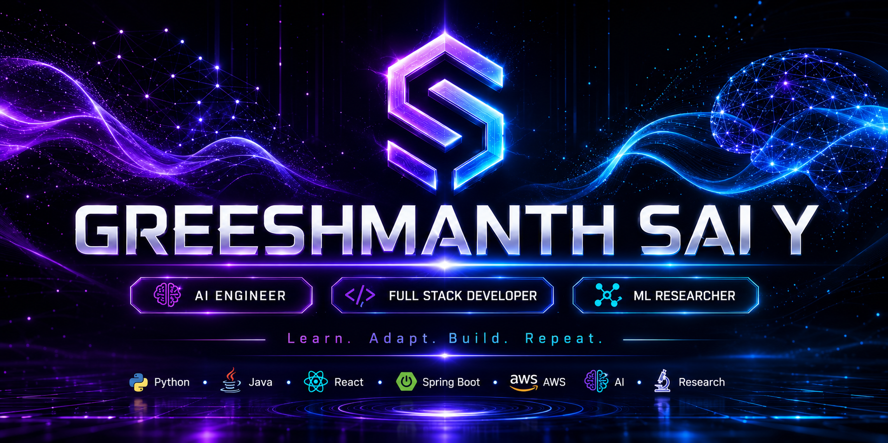
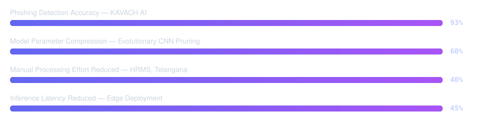

  

  

  

 

## Profile Snapshot

| | |
|---|---|
| **Current Role** | Software Development Engineer I — AI/ML & Full-Stack, InfoShare Systems *(Sep 2025 – Present)* |
| **Education** | B.Tech, Computer Science & Engineering — Amrita Vishwa Vidyapeetham, Coimbatore *(2021 – 2025)* |
| **Core Domains** | AI & ML Engineering · Full-Stack Development · Backend Engineering · Cloud Computing · Data Engineering |
| **Languages Spoken** | English (Fluent) · Telugu (Native) · Tamil (Fluent) · Hindi (Fluent) |
| **Certifications** | OCI 2025 Certified Generative AI Professional · OCI 2025 Certified AI Foundations Associate |
| **Philosophy** | Learn. Adapt. Build. Repeat. |

I build production software for government-scale platforms and run independent research in model compression and ML-driven cybersecurity on the side — from CUDA-accelerated pruning experiments to citizen-facing dashboards processing real public-sector workflows.

## Experience

**Software Development Engineer I — AI/ML & Full-Stack**
InfoShare Systems · *Sep 2025 – Present*
`React` `Angular` `Spring Boot` `.NET Core` `Python` `MySQL`

<b>View detailed contributions</b>

 

- **HRMS (PJTSAU, Telangana)** — Built the pension management module in React.js (Context API, reusable components) for government HR operations; designed layered REST APIs (Controller–Service–Repository) on MySQL for employee records and pension calculations — reduced manual processing effort by **~40%**.
- **VRES (Government Voucher Platform)** — Developed the React.js frontend enabling citizens to submit and track voucher redemptions; integrated REST APIs covering the full voucher lifecycle (creation, validation, status tracking) — significantly cut processing turnaround time.
- Built enterprise backend services in Java (Spring Boot), .NET Core, and Angular for government digital infrastructure, and integrated Python ML pipelines directly into production backend workflows.
- Optimized MySQL/MariaDB through schema redesign and query tuning to reduce API response latency; delivered work across Agile sprints using JIRA and CI/CD.

 

**Data Science Intern**
PhyCARE Services (India) Pvt. Ltd., Hyderabad · *Mar 2025 – May 2025*
`Python` `Pandas` `SQL`

<b>View detailed contributions</b>

 

- Built end-to-end data analysis pipelines using Python, Pandas, and SQL to process operational datasets and surface actionable business insights — reduced analyst query time by **~30%**.
- Performed data cleaning, feature transformation, and exploratory data analysis across multiple organizational datasets, improving downstream data quality and consistency.
- Automated **5+ recurring data workflows**, saving **~10 hours/week** of manual reporting effort.

## Featured Projects

| Project | Focus | Key Result | Stack |
|---|---|---|---|
| **KAVACH AI** | ML-based phishing & cybersecurity threat detection | ~93% accuracy, ~91% recall | Python · XGBoost · PU Learning · React.js · AWS EC2 |
| **Evolutionary CNN Pruning** | Neural network compression for edge deployment | ~60% parameter reduction, <2% accuracy loss | PyTorch · CUDA · Deep Learning |
| **Stock Market Prediction System** | Financial time-series forecasting | ~78% directional accuracy | Python · ML · Time Series |
| **Virtual Classroom Platform** | Full-stack Learning Management System | 3+ course modules, full auth & role management | Java (JSP) · MySQL · JavaScript |
| **Cibus** | Regional food discovery platform | Interactive regional exploration UX | HTML · CSS · JavaScript |

<b>KAVACH AI — full breakdown</b>

 

*Feb 2026 – Apr 2026 · Python · XGBoost · PU Learning · React.js · REST APIs · MySQL · AWS EC2*

A full-stack phishing detection platform with a Python ML backend classifying URLs via DNS, WHOIS/RDAP, TLS/SSL, and behavioral signals, paired with a React.js dashboard for real-time result visualization, deployed on AWS EC2.

- Engineered a PU Learning + XGBoost classification pipeline achieving **~93% accuracy** and **~91% phishing recall** on a multi-source URL dataset, directly addressing real-world label-scarcity challenges.
- Developed RESTful APIs for dataset uploads, ML inference, and structured result storage in MySQL.
- Automated file processing pipelines, reducing end-to-end detection latency by **~35%**.

<b>Evolutionary Algorithm-Based CNN Model Pruning — full breakdown</b>

 

*Jul 2024 – May 2025 · Python · CUDA · PyTorch · Deep Learning · Model Compression*

- Designed an evolutionary pruning framework using adaptive genetic masking, achieving **~60% parameter reduction** with under **2% accuracy drop** across tested architectures.
- Formulated a fitness-driven multi-objective optimization strategy balancing FLOPs minimization, parameter reduction, and accuracy preservation — reducing inference latency by **~45%** for edge deployment.
- Built GPU-accelerated experimentation workflows with CUDA and PyTorch for rapid benchmarking of pruned model variants.

<b>Stock Market Prediction System — full breakdown</b>

 

*Oct 2023 – Dec 2023 · Python · Machine Learning · Time Series Forecasting*

- Engineered ML models for financial time-series forecasting using historical OHLCV data with lag-based and rolling-window feature engineering, achieving **~78% directional accuracy**.
- Applied regression and classification techniques to identify market trends and generate data-driven signals.

<b>Virtual Classroom Platform — full breakdown</b>

 

*Feb 2024 – Apr 2024 · Java (JSP) · MySQL · HTML · CSS · JavaScript*

- Developed a full-stack LMS supporting course delivery, student–instructor collaboration, and content management for 3+ course modules.
- Built secure Java JSP backend services with MySQL for user authentication, role management, and course content storage.

## Research

**Hybrid Differential Evolution-Based Layer-Wise Weight Pruning for Edge-Level IoT Devices**
*Research Manuscript — Under Preparation* · `Python` `PyTorch` `Evolutionary Algorithms` `Neural Network Compression`

- Designed hybrid differential evolution algorithms for layer-wise weight pruning of deep neural networks, targeting resource-constrained IoT edge devices, achieving significant model compression while maintaining competitive accuracy.
- Conducted systematic experimental evaluation across compression ratio, inference latency, and accuracy benchmarks on multiple network architectures.

## Technical Skills

 

| Category | Skills |
|---|---|
| **Languages** | Python · Java · C++ · C · JavaScript · TypeScript · SQL |
| **Frontend** | React.js · Angular · Next.js · HTML5 · CSS3 · Bootstrap |
| **Backend** | Spring Boot · Node.js · Express.js · .NET Core · REST APIs · Microservices |
| **Databases** | MySQL · MariaDB · PostgreSQL · Oracle SQL |
| **Cloud & DevOps** | AWS EC2 · Docker · Git · GitHub · CI/CD · JIRA |
| **AI / ML** | PyTorch · TensorFlow · Scikit-learn · XGBoost · Deep Learning · NLP · MLOps · PU Learning |
| **CS Fundamentals** | DSA · OOP · DBMS · Operating Systems · Computer Networks · System Design · API Design · Distributed Systems |

## Achievements

 

| Achievement | Impact |
|---|---|
| Government Systems Engineering | Delivered production-grade HRMS & voucher management infrastructure for Telangana state departments |
| KAVACH AI | Cloud-hosted cybersecurity intelligence platform — ~93% phishing detection accuracy via PU Learning + XGBoost |
| Deep Learning Research | ~60% neural network parameter reduction with <2% accuracy degradation for edge deployment |
| Enterprise Engineering | Designed and shipped scalable backend & full-stack systems across Agile sprints |
| Applied AI | Integrated production ML pipelines into live backend workflows |

## GitHub Analytics

  

  

<picture>
  <source media="(prefers-color-scheme: dark)" srcset="https://raw.githubusercontent.com/GreeshmanthSaiY/GreeshmanthSaiY/output/github-contribution-grid-snake-dark.svg">
  <source media="(prefers-color-scheme: light)" srcset="https://raw.githubusercontent.com/GreeshmanthSaiY/GreeshmanthSaiY/output/github-contribution-grid-snake.svg">
  
</picture>

## Currently

| Building | Learning | Exploring |
|---|---|---|
| KAVACH AI | Agentic AI & LLM Engineering | AI Infrastructure & MLOps |
| Government software systems @ InfoShare | Retrieval-Augmented Generation (RAG) | Intelligent Automation |
| Hybrid DE pruning research manuscript | Distributed & Cloud-Native Systems | Large Language Models |

 

